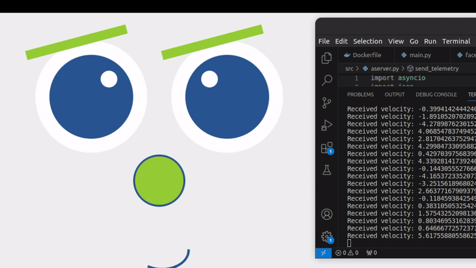

# Qt-face

This project is part of Toradex Self-balancing bot demo (LINKPLACEHOLDER) presented at Embedded World 2024.

It consists of 2 parts, a front-end and a back-end.

## Front End
The front end is a Qt aplication with a the robot face and some simple expressions

## Back End
The back end is a Qt websocket server, that receives data from a controller (to move the robot manually) and from a gyro+accel device (for the feedback controle).

There's a simple logic example implemented to control the robot face given the velocity reading.



# How to Run
1. Get the docker-compose file
    ```
    wget https://raw.githubusercontent.com/Allan-Kamimura/EW2024-qtface/main/face.yml
    ```

2. Run main
    ```
    docker compose -f qt-face.yml up -d
    ```

3. (optional) Run with parameters, those are the default values
    ```
    ADDRESS=0.0.0.0:8000 v1=-7 v2=-3 v3=0 v4=3 v5=7 stepsIn10s=10 delaytime=8000 docker-compose -f face.yml up -d
    ```

    The "v" stands for velocity thresholds: `v1 < v2 < v3 < v4 < v5` -> sets the default expression

    v0 | v1 | v2 | v3 | v4 |v5 | v6
    -- | -- | -- | -- | -- | --| --
    maluco | sad | happy |sapecao | angry | maluco

# Logs
The container mounts `~/:~/` and logs are saved to `~/` 
